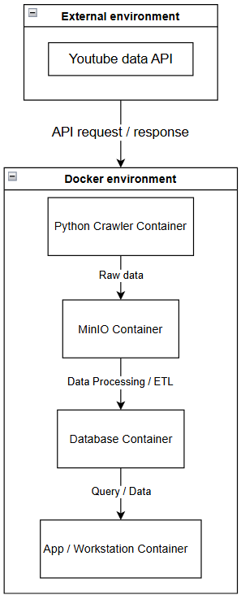

# Docker Architecture

## 1. Overview

The Trending Content Analysis project uses a Docker-based architecture
to provide an isolated and reproducible environment for data ingestion,
storage, processing, and analysis.

The system integrates data from the YouTube Data API and processes the
data through several containerized components.

## 2. Architecture Diagram

## 3. System Components

### 3.1 YouTube Data API

The YouTube Data API is an external data source outside the Docker
environment.

It provides the data required for the Trending Content Analysis project.

The Python crawler sends API requests to the YouTube Data API and
receives the corresponding responses.

### 3.2 Python Crawler Container

The Python Crawler Container is responsible for collecting data from
the YouTube Data API.

Main responsibilities:

- Send API requests to the YouTube Data API
- Receive API responses
- Extract relevant video information
- Store collected data as raw data
- Send raw data to the MinIO container

### 3.3 MinIO Container

The MinIO Container provides object storage for the collected raw data.

It acts as the project's Data Lake storage layer.

Main responsibilities:

- Store raw data collected by the crawler
- Organize raw datasets
- Provide persistent object storage
- Serve as the input source for the data processing and ETL stage

### 3.4 Database Container

The Database Container stores processed and structured data.

Data is transferred from MinIO to the database through the data
processing and ETL stage.

Main responsibilities:

- Receive processed data
- Store structured datasets
- Provide persistent database storage
- Support data queries from the application or workstation

### 3.5 App / Workstation Container

The App / Workstation Container is used to interact with and analyze
the data stored in the database.

Main responsibilities:

- Query data from the database
- Perform data analysis
- Support application and analysis workflows
- Consume processed data for downstream tasks

## 4. Data Flow

The system follows the following data flow:

1. The Python Crawler Container sends requests to the YouTube Data API.
2. The YouTube Data API returns the requested data.
3. The crawler stores the collected data as raw data.
4. Raw data is transferred to the MinIO Container.
5. Data processing and ETL operations transform the raw data.
6. Processed data is stored in the Database Container.
7. The App / Workstation Container queries the database for analysis
   and application tasks.

## 5. Container Communication

The main project components run inside the Docker environment and
communicate with each other through the Docker network.

The external YouTube Data API is accessed from the Python Crawler
Container through API requests.

The internal data flow is:

Python Crawler
      |
      v
    MinIO
      |
      v
Data Processing / ETL
      |
      v
  Database
      |
      v
App / Workstation

## 6. Benefits of the Docker Architecture
Using Docker provides several benefits for the project:
- Consistent development environments
- Isolation between project components
- Reproducible configuration
- Easier setup for team members
- Simplified service management
- Clear seperaion between data ingestion, storage, processing, database, and analysis components
